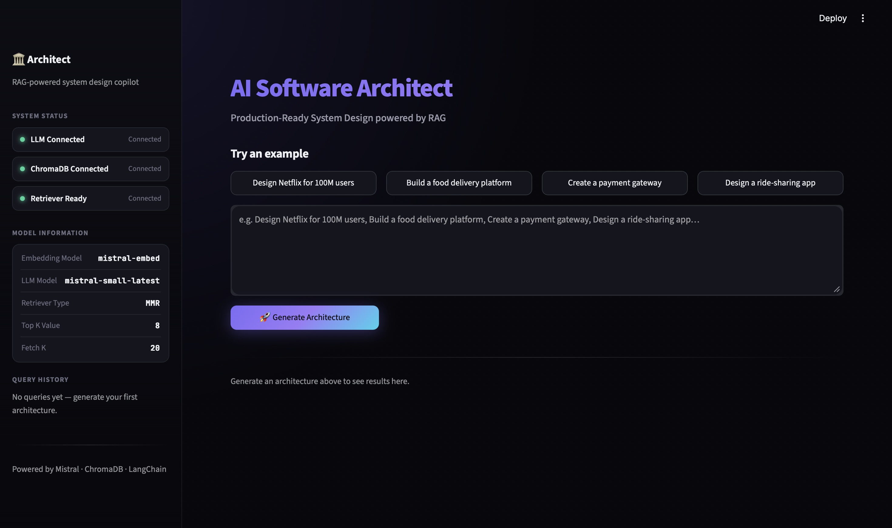
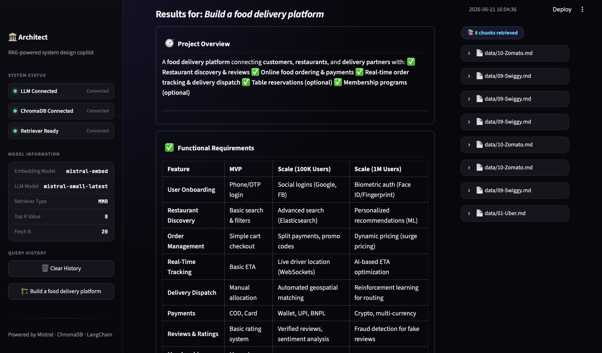
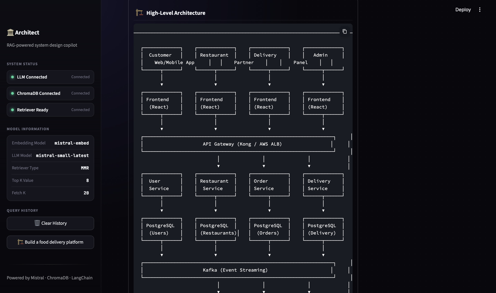

# 🏗️ AI Software Architect


> AI-powered Software Architecture Assistant built using LangChain, Mistral AI, ChromaDB, and Streamlit.

---

## 🚀 Overview

AI Software Architect is a Retrieval-Augmented Generation (RAG) application that helps developers, students, and software engineers design scalable software systems using real-world architecture patterns.

The system retrieves relevant architectural knowledge from a ChromaDB vector store and uses Mistral AI to generate production-ready architecture recommendations.

### 📸 Application Dashboard



---

## ✨ Features

- 🔍 Retrieval-Augmented Generation (RAG)
- 🧠 Mistral AI Powered Responses
- 📚 ChromaDB Semantic Search
- ⚡ MMR Retrieval Strategy
- 🏗️ Architecture Recommendations
- 📊 Database Design Suggestions
- 🔐 Security & Reliability Planning
- 📈 Scalability Roadmaps
- 🎨 Premium Streamlit Dashboard
- 📄 Markdown Export Support

---

## 🎯 Example Query

```text
Design a ride-sharing application for 1M+ users
```

The assistant generates:

- Functional Requirements
- Recommended Tech Stack
- Database Design
- API Design
- Security Strategy
- Scalability Plan
- Architecture Diagram

### 📸 Architecture Generation



---

## 🏛️ Generated Architecture Diagram

The assistant automatically creates a high-level architecture diagram showing:

- Frontend Layer
- Backend Services
- Databases
- Cache Layer
- External Integrations
- Service Communication



---

## 🛠️ Tech Stack

| Layer | Technology |
|---------|------------|
| Frontend | Streamlit |
| LLM | Mistral AI |
| Framework | LangChain |
| Vector Database | ChromaDB |
| Embeddings | Mistral Embeddings |
| Language | Python |

---

## 📂 Project Structure

```text
AI-Software-Architect/
│
├── data/
├── demo/
├── core.py
├── vec_store.py
├── ui.py
├── system.txt
├── requirements.txt
├── .gitignore
└── README.md
```

---

## ⚙️ Installation

### Clone Repository

```bash
git clone https://github.com/naharaarushi/AI-Software_architect
cd AI-Software-Architect
```

### Create Virtual Environment

```bash
python -m venv .venv
source .venv/bin/activate
```

### Install Dependencies

```bash
pip install -r requirements.txt
```

### Configure Environment Variables

Create a `.env` file:

```env
MISTRAL_API_KEY=YOUR_API_KEY
```

### Run Application

```bash
streamlit run ui.py
```

---

## 🔄 RAG Workflow

```text
User Query
     │
     ▼
Embedding Generation
     │
     ▼
ChromaDB Retrieval
     │
     ▼
Relevant Context
     │
     ▼
Prompt Construction
     │
     ▼
Mistral AI
     │
     ▼
Generated Architecture
```

---

## 🔮 Future Enhancements

- Multi-Document RAG
- Hybrid Search
- Agentic Architecture Planning
- Architecture Diagram Export
- Multi-LLM Support
- Cloud Deployment

---

## 👨‍💻 Author

**Arushi Kumari**

BCA (AI/ML)

AI • GenAI • RAG • Machine Learning

GitHub: https://github.com/naharaarushi

---

## ⭐ Support

If you found this project useful:

⭐ Star the repository

🍴 Fork the repository

🚀 Build something awesome